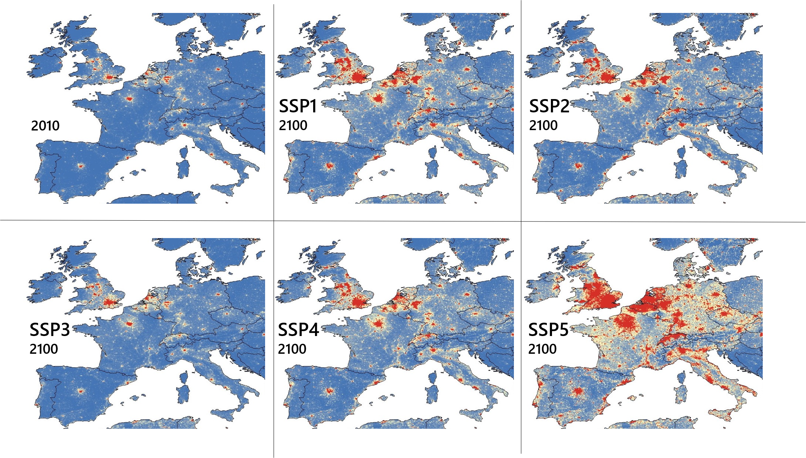
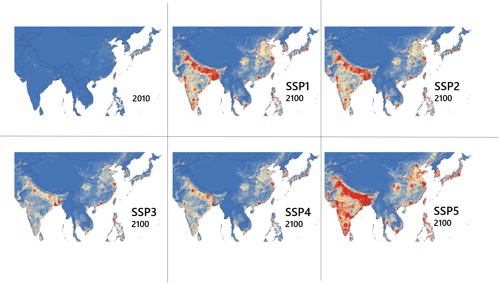

--- 
title: Gridded GDP projections compatible with the five SSPs
author: "Global Carbon Project (Tsukuba International Office), NIES and ISM, Japan"
date: "February, 2020"
site: bookdown::bookdown_site
output: bookdown::gitbook
always_allow_html: yes
documentclass: book
bibliography: [book.bib, packages.bib]
biblio-style: apalike
link-citations: yes
github-repo: rstudio/bookdown-demo
description: "This is a website for showing and providing our estimated GDP with 1/12-degree grid-scale during 2000—2100 by 10 year intervals."
---

# Dowonscaling GDP

Historical and future spatially explicit population and GDP data are critically important for analysing climate risks in the future. Population projection exists such as HYDE database, but GDP projection does not exist especially SSP compatible scenarios. So, we have estimated GDP with 1/12-degree grid-scale during 1850—2100 by 10 year intervals. National GDP data was downscaled to grids using the past data until 2010 and future data until 2100 of SSPs. In the downscaling algorithm, we first assumed spatial and economic interactions among cities and projected future different urban growth patterns according to SSPs. Then, the projected urban growth patterns and other auxiliary geographic data (land cover, road network, etc.) were used to estimate the gridded GDP distributions. Finally, the estimated GDPs were visualized in 3D for the intuitive understanding for multiple stakeholders. Our results suggested that spatial pattern of urban and peri-urban GDP could change considerably depending on SSPs. For example, GDP of SSP1 shows rapid urban growth nearby major cities while SSP3 shows lower level of urban growth nearby the cities, and SSP5 shows extreme urban dispersion.

Methods which we used are detaily described in our forthcoming paper: Murakami, Yamagata and Yoshida (202X). Please see the reference section below.

## Visualization






```{r setup, include=F, echo=F, warning=F}
knitr::opts_chunk$set(echo = TRUE)
library(colorRamps)
library(data.table)
library(dplyr)
library(gdalUtils)
#library(globe)
library(htmlwidgets)
library(raster)
library(rgdal)
library(stars)
library(sf)
library(stringr)
library(threejs)
library(tidyr)

#set.dir <- "D:/Dropbox/A_Rcodes/SSP/HTML_hp/"
################
list.f <- list.files("C:/Users/yoshida.takahiro/Dropbox/A_Rcodes/SSP/CSV_hp")
#list.f <- list.files("D:/Dropbox/A_Rcodes/SSP/CSV_hp")
list.f2 <- gsub("\\.[0-9A-Za-z]+$", "", list.f)

#for(i in 1:length(list.f)){
i=1
a <- fread(paste("C:/Users/yoshida.takahiro/Dropbox/A_Rcodes/SSP/CSV_hp/",list.f[i],sep="")) %>%
     mutate(gdp=if_else(gdp>0,gdp,0)) %>%
     filter(gdp>0) %>%
     mutate(gdp.cut=as.numeric(cut(gdp,breaks=c(0, 10000, 100000, 1000000, 2500000, 5000000, 10000000, 25000000, 50000000, 100000000, 1000000000, max(gdp)), 
                                   include.lowest=TRUE))) %>%
     mutate(pid=as.numeric(rownames(.))%%10) %>% # because the globejs function cannot accept all points.
     filter(pid==0)
set.col <-  matlab.like(11)[a$gdp.cut]
A <- globejs(lat=a$latitude, long=a$longitude,
        val=a$gdp/70000000,    # Bar height 
        color=set.col,
        pointsize=1.6,
        atmosphere=F)
#saveWidget(A, file=paste(set.dir, list.f2[i], ".html",sep=""))
#}
```


```{r code2, echo=F,out.width = '100%'}
A
#knitr::include_url("https://kepler.gl/demo/map?mapUrl=https://dl.dropboxusercontent.com/s/b4okyibxy94be4l/keplergl_t3rc9hk.json")
```
Figure: Interactive 3D globe maping on downscaled GDP in 2000. You can pan and zoom the globe by mouse-over.

## Data download

The GDPs for SSP 1–5 between 2000 and 2100 by 10 years are estimated by 2160 x 4320 grids, each of which are 1/12-degree grids, covering the globe. The GDP estimates in each year in each SSP are recorded as a GeoTIff image with resolution of 2160 x 4320. GeoTiff is a Tiff image with spatial coordinates for each grid cell; the coordinates are given by longitude and latitude measured by World Geodetic System 1984 (WGS84).

***please click here: tiff and csv files***

And also, you can download 3D globemap html files on the five SSPs (2000-2100) from the link below.

***please click here: 3D globemaps***

## References
- Daisuke Murakami, Yoshiki Yamagata, Takahiro Yoshida (202X) Gridded GDP projections compatible with the five SSPs (Shared Socioeconomic Pathways). Submitted to a journal. 


`r if (knitr:::is_html_output()) '

'`

